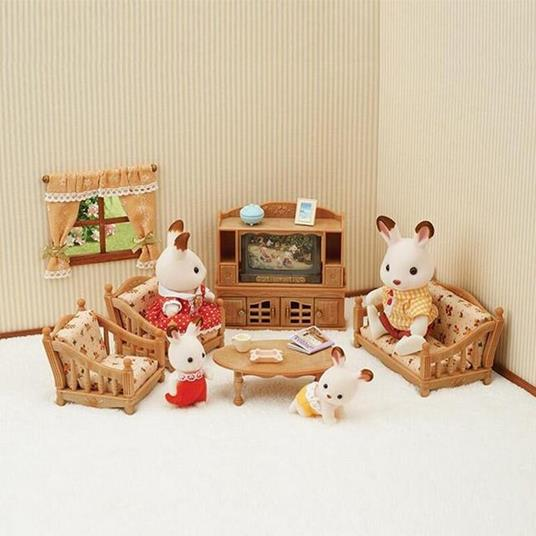
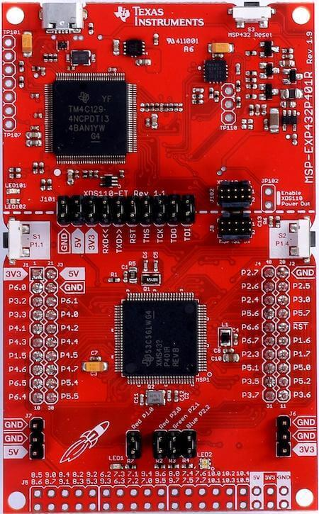
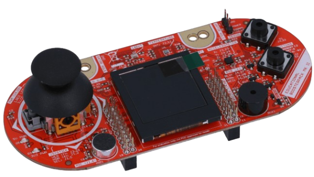

# Sylvanian Tech Family

- [Sylvanian Tech Family](#sylvanian-tech-family)
  - [Project Description](#project-description)
    - [What's better than a domotic house? A Sylvanian Family domotic house!](#whats-better-than-a-domotic-house-a-sylvanian-family-domotic-house)
    - [Presentation and video](#presentation-and-video)
  - [Requirements](#requirements)
    - [Hardware](#hardware)
    - [Software](#software)
    - [Pin out](#pin-out)
  - [Getting started](#getting-started)
    - [Building the project](#building-the-project)
    - [Burning the project](#burning-the-project)
    - [Running the project](#running-the-project)
  - [Team members](#team-members)
  - [Project documentation](#project-documentation)
  - [Project layout](#project-layout)

## Project Description

#### What's better than a domotic house? A Sylvanian Family domotic house!



The Sylvanians are a puppet family who lives in a traditional doll house.
To help them out in their daily life, in keeping the house warm and safe, and
the garden greener than the neighbour's one, we've built an Embedded System
that can contribute in common routines and that adds safety to those assailable
cardboard walls.

This project was built with the intention of concretely replicating all the notions
acquired during the Embedded System for the Internet of Things course.
Our aim is to implement in a single embedded system extensive control over the
most frequently used things in a house.

Many features have been added to the house:

- Alarm system
- Earthquake detector
- Automated lights
- Automated front door
- Climate plant
- Irrigation plant

The LCD has been used to display real-time events.

> > "Many functionalities of a microcontroller have been used:
> > pwm, i2c protocol, serial communication, digital write, digital read
> > and task management as in a modern rtos using physical interrupts,
> > timer interrupts etc..."

> > Questo ha senso metterlo per noi o ci tiriamo la zappa sui piedi da soli?
> > Di "funzionalità" alla fine non ne usiamo tante...

### Presentation and video

-[Presentation](https://docs.google.com/presentation/d/1W6sGwKaeywJN_hmt3aGy_PK22Og2mWv0d_z1uNpjzVE/edit?usp=drivesdk)

-[Video presentation]()

## Requirements

### Hardware

- [TI MSP432P401R Microcontroller](https://www.ti.com/lit/ds/slas826e/slas826e.pdf)
- [TI BOOSTXL-EDUMKII BoosterPack](https://www.ti.com/tool/BOOSTXL-EDUMKII)
  - **Elenco sensori, timer, etc usati...**
- Breadboard
- 2 LEDs
- 1 servo motor
- 1 buzzer
- wires





> > Altro?

### Software

- [CodeComposerStudio](https://www.ti.com/tool/download/CCSTUDIO/12.2.0)
  > > Che serve?? CCS studio? altro?

### Pin out

> > Qua, Cristiano, pensavi di fare mappatura pin con thinkercad?

- Red Led: J1.5 maps to Port 4.1
- Blu led: J1.6 maps to Port 4.3
- Additional Buzzer: J4.40 maps to Port 2.7

## Getting started

Place the TI driverlib `source` folder inside the `driverlib` folder like this:


> You can download the driverlib folder
> from [here](https://drive.google.com/file/d/1w_YTRS9HwMnIs1PKtQFa6hqd9J2PM_93/view?usp=sharing)

### Building the project

Open the folder `embedded-project-src` in CCS.

> Note: do NOT open in CCS the whole `embedded_project` folder, since it contains additional files that are not needed for the CCS project.

The project includes are already set up to include the driverlib folder, you should be able to build the project without
any additional setup.

ARM compiler include options:

- `${PROJECT_ROOT}/../driverlib/source`

ARM linker file search path options:

- `${PROJECT_ROOT}/../driverlib/source/ti/devices/msp432p4xx/driverlib/ccs/msp432p4xx_driverlib.lib`

### Burning the project

> > Need help ragazzi

### Running the project

> > Need help anche qua, mettiamo come runnare su CCS?

## Team members

Every team member is responsible for the whole project, despite individual contributions such as following:

- Berardo Cristiano designed house alarm, its buzzer and voltmeter, and wired connections
- De Piccoli Martina designed house irrigation plant and earthquake detector using the accelerometer
- Lovo Nicola (coordinator) designed house front door, its servo motor and light sensor
- Prati Matilde designed house climate system and handled temperature sensor outputs

## Project documentation

> > Togliamo requirements document???

- [Requirements document](https://docs.google.com/document/d/1dMhPBvmx1WDsUFHWIUvdtsMsZ3I_5LDLPtr0CWYLqqE/edit?usp=sharing)
- [Project diagram](https://drive.google.com/file/d/1CTdshm4JGh88nT_NAp6nMx0BeLaoV-mB/view?usp=sharing)

## Project layout

```
├───docs
├───driverlib
│   └───source
└───embedded-project-src
│   ├───features
│   │   ├───allarm
│   │   ├───climate
│   │   ├───door
│   │   ├───frontDoorLight
│   │   ├───irrigation
│   │   └───radiator
│   ├───lcdDisplay
│   ├───outputs
│   │   ├───blueLED
│   │   ├───buzzer
│   │   ├───redLED
│   │   └───servo
│   ├───sensors
│   │   ├───accelerometer
│   │   ├───allarm
│   │   ├───climate
│   │   ├───doorButton
│   │   ├───irrigationButton
│   │   ├───light
│   │   └───voltmeter
│   ├───targetConfigs
│   ├───testing
│   │   ├───allarm
│   │   └───door
│   └───tools
└───LcdDriver
```
