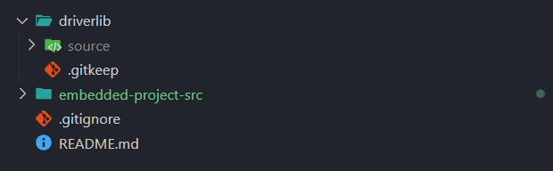

# Embedded project

- [Embedded project](#embedded-project)
  - [Getting started](#getting-started)
    - [Building the project](#building-the-project)
  - [Project documentation](#project-documentation)

## Getting started

Folder structure:

```
embedded_project
├── embedded-project-src
│   └── main.c
├── driverlib
├── .gitignore
└── README.md
```

Place the TI driverlib `source` folder inside the `driverlib` folder like this:



> You can download the driverlib folder from [here](https://drive.google.com/file/d/1w_YTRS9HwMnIs1PKtQFa6hqd9J2PM_93/view?usp=sharing)

### Building the project

Open the folder `embedded-project-src` in CCS.

> Note: do NOT open the `embedded_project` folder, since it contains additional files that are not needed for the project.

The project includes are already set up to include the driverlib folder, you should be able to build the project without any additional setup.

ARM compiler include options:

- `${PROJECT_ROOT}/../driverlib/source`

ARM linker file search path options:

- `${PROJECT_ROOT}/../driverlib/source/ti/devices/msp432p4xx/driverlib/ccs/msp432p4xx_driverlib.lib`

## Project documentation

- [Requirements document](https://docs.google.com/document/d/1dMhPBvmx1WDsUFHWIUvdtsMsZ3I_5LDLPtr0CWYLqqE/edit?usp=sharing)
- [Project diagram](https://drive.google.com/file/d/1CTdshm4JGh88nT_NAp6nMx0BeLaoV-mB/view?usp=sharing)